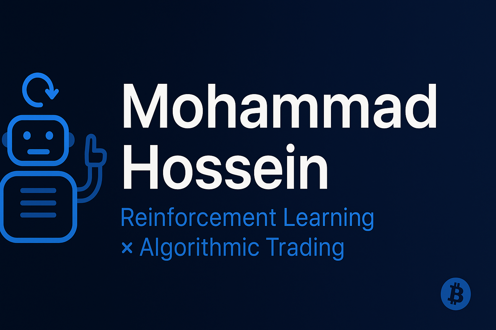

<!-- README.md for GitHub profile (English content) -->

<!-- Banner: place a banner image at assets/banner.png (recommended size: ~1200x300) -->
<p align="center">
  
</p>

<h1 align="center">Hi 👋, I’m Mohammad Hossein — RL researcher & Python developer</h1>

<p align="center">
  <em>I'm a Python developer and master's student passionate about Artificial Intelligence — especially Reinforcement Learning. My research focuses on optimizing RL algorithms for algorithmic trading in financial markets, aiming to build intelligent trading agents that adapt to real-world market dynamics.</em>
</p>


<p align="center">
  <a href="https://github.com/M-H-Tabatabai"></a>
  <a href="https://github.com/M-H-Tabatabai"></a>
  
</p>

---

## About Me
- 🎓 Master's student in Software Engineering (Tarbiat Modares University) — currently ranked **#1** in the program.  
- 🔬 Research focus: Reinforcement Learning applied to financial markets — especially algorithmic trading in cryptocurrencies (robust agents under noise, latency, and transaction costs).  
- 🏅 Academic highlights: Earned **A** grades in Machine Learning and Reinforcement Learning courses.  
- 💻 Primary programming language: **Python**. I build reproducible pipelines, custom Gym environments, and benchmark RL agents.

---

## Key Skills
**Technical**
- Python, NumPy, Pandas  
- Reinforcement Learning (policy & value methods), Stable-Baselines3, OpenAI Gym  
- Machine learning fundamentals, model evaluation & backtesting  
- Databases & SQL, data pipelines, Docker, Git / GitHub, CI (GitHub Actions)  

**Software Engineering**
- Algorithm design, system design basics, Agile & Scrum practices  
- Testing, reproducibility, packaging (pip-installable demos)

**Soft Skills**
- Discipline, responsibility, teamwork, problem solving, time management, creativity, eagerness to learn

---

## Featured / Suggested Projects
> Note: Replace links below with your real repo URLs when available.

### [📌 rl-trading-prototype](https://github.com/hossein/rl-trading-prototype)  
Reproducible end-to-end pipeline for training and backtesting RL agents on crypto price data — includes notebooks, training scripts, and evaluation dashboards.

### [📌 gym-crypto-env](https://github.com/hossein/gym-crypto-env)  
Custom OpenAI Gym environments modeling realistic trading frictions: latency, slippage, order execution and transaction costs.

### [📌 research-notebooks](https://github.com/hossein/research-notebooks)  
Curated notebooks for experiments, literature reproductions and short tutorials on implementing and evaluating RL algorithms for trading.

---

## Demo
<p align="center">
  
</p>

---

## Quickstart (example)
```bash
# clone a featured repo (example)
git clone https://github.com/hossein/rl-trading-prototype.git
cd rl-trading-prototype
pip install -r requirements.txt
# run a demo notebook or script
jupyter notebook demo.ipynb

